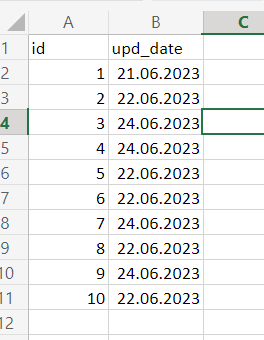
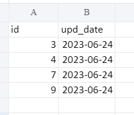

## Task 04

Напишите программу, которая будет обращаться к файлу Excel в локальной папке, извлекать новые данные с датой добавления на вчера (поле upd_date) и отправлять их на почту.

Тестовый файл имеет вид: 

Решение: main.py

Сначала формируется отчет, потом он отправляется на почту в виде файла `Datas.xlsx`
