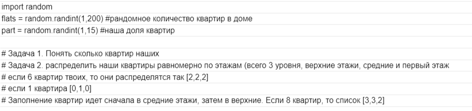

## Task 09

Решение: main.py

Рассматриваем случаи с целыми квартирами, поэтому кейсы, где в доме 1 квартира, а наша доля, допустим, 20%, не будет считаться за полноценную квартиру.

По формуле считаем количество целых квартир, а дальше по простому алгоритму распределяем по этажам, начиная со средних.