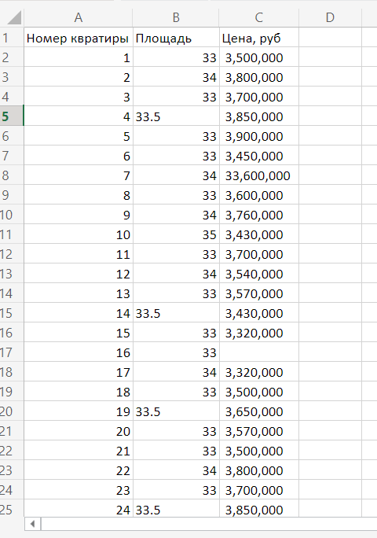

## Task 10

Одному из подразделений нужно оценить стоимость 1-ком квартир и стоимость 1 кв.м таких квартир в одном из ЖК.

У вас есть данные по 1-ком квартирам в таблице 1. Приведите ваши расчеты на python с комментариями.

Таблица 1:

Решение: main.py

Сначала подумал, что ошибка в таблице с данными, и хотел просто посчитать среднюю стоимость квадратного метра. Потом понял, что нужно оценить стоимость квартир (в данном случае одной квартиры), где их цена не указана.

Алгоритм такой: собираем только те значения, у которых корректно указана площадь и есть цена. Пустые поля записываем в мапу с ключом номера квартиры и значением площади, чтобы в дальнейшем посчитать ее стоимость.

После того, как переписали данные, отправляем их в функцию `detect_outliers`, которая оставляет только те данные, которые находятся в рамках общей массы (таким образом отсеиваем неадекватные значения, такие как 33млн за квартиру той же площади на фоне общей массы), и сразу же считаем среднее значение. На всякий случай, то же самое делаем и для площадей.

Далее считаем среднюю цену за квадратный метр, и в цикле считаем стоимость всех квартир, на которые нужно было рассчитать стоимость