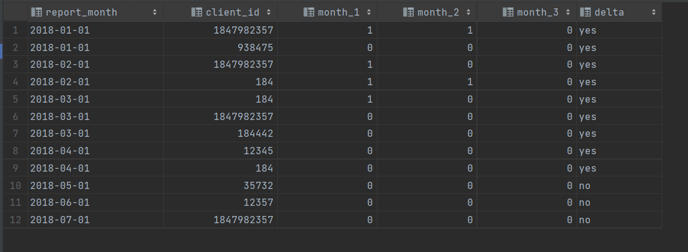
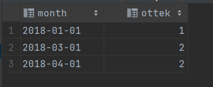
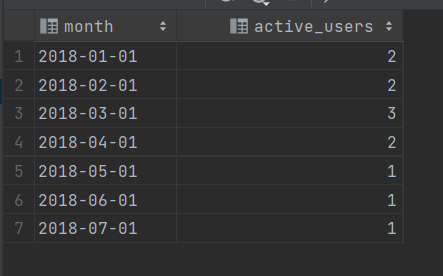
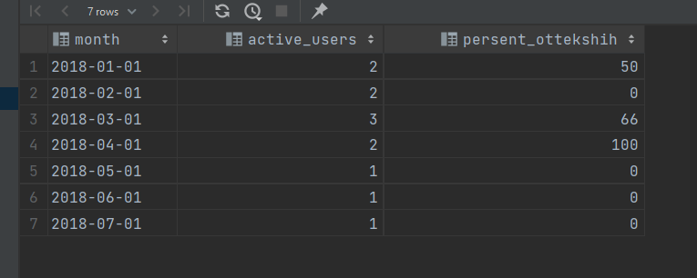

## Task 06

Описание данных: таблица ACTIVE_CLIENTS содержит ежемесячный срез клиентов банка, которые совершали какие-либо транзакции в данном месяце.

Атрибуты: отчетный месяц (report_month) и идентификатор клиента (client_id). Считаем, что клиент «оттек» из банка в месяце N, если в месяце N он активен (присутствует в таблице ACTIVE_CLIENTS) и не активен в месяцы N+1, N+2, N+3 (т.е. в течение 3-х месяцев).

| REPORT_MONTH | CLIENT_ID  |
|---|------------|
|01/01/2018| 13453412   |
|01/01/2018| 1243252521 |
|02/01/2018| 12453412   |
|...|...|

Вывести количество активных клиентов на каждый месяц; долю клиентов, которые «оттекли» в каждом месяце.

Решение: main.sql

Пояснение решения: создаем первое представление max_date, в котором содержится последняя дата в БД. Все клиенты в БД, которые пользовались приложением минимум за 1-2 месяца от максимального (последнего в БД), не будут считаться оттекшими.

В представлении all_checks создается таблица с новыми столбцами month1 - month3, в которых будет отмечено, пользовался ли пользователь приложением в тот или иной месяц, считая от текущего. Пользователь считается оттекшим в текущем месяце, если в последующих 3х месяцах он приложением не пользовался, и в то же время в столбце delta (столбец сравнения текущей даты с максимальной, если разница больше 3 - yes, если меньше - no) находится значение `yes`.

В представлении all_ottok применяем вышеупомянутые фильтры, группируем по дате и в столбце ottek будет находиться количество оттекших пользователей за каждый месяц.

В представлении active_in_month находятся все активные пользователи за тот или иной месяц. Пользователи, которые не пользовались приложением в текущем месяце, но пользовались им 1-2 месяца назад, не считаются активными пользователями в текущем.

В последнем запросе джоиним к представлению active_in_month представление all_ottok по месяцу, в конечном итоге имеем таблицу:

